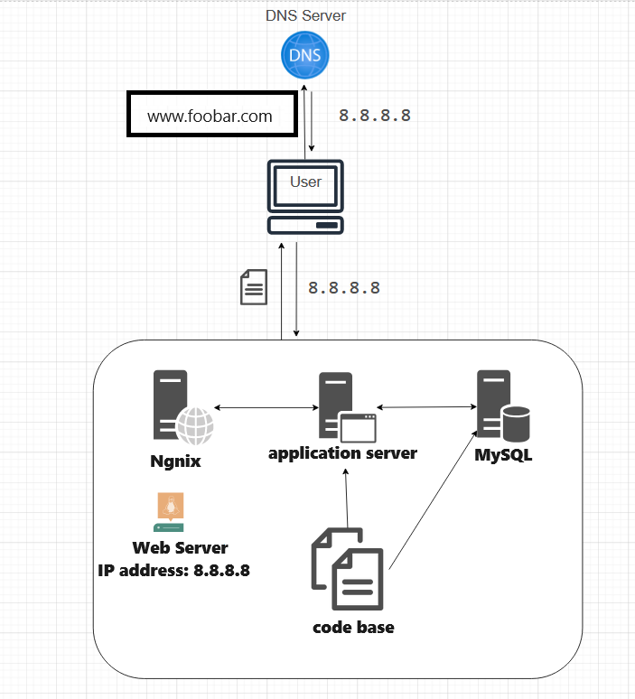

# Simple Web Stack

## Description

This project showcases a basic web infrastructure for hosting a website accessible via `www.foobar.com`. The setup does not include firewalls or SSL certificates for network protection. Each component (database, application server) relies on the server's shared resources (CPU, RAM, and SSD).

## Key Details

+ **Server Definition:** A server refers to either computer hardware or software that provides services to other computers, typically known as *clients*.

+ **Domain Name Significance:** Domain names serve as human-friendly aliases for IP Addresses. For instance, `www.wikipedia.org` is easier to remember than `91.198.174.192`. The mapping between IP addresses and domain name aliases is handled by the Domain Name System (DNS).

+ **DNS Record for `www.foobar.com`:** `www.foobar.com` utilizes an **A record**. This can be verified by running `dig www.foobar.com`. Note that the results may vary, but this infrastructure design uses an **A** record.
  *Address Mapping record (A Record):* Also known as a DNS host record, it stores a hostname and its corresponding IPv4 address.

+ **Web Server Role:** The web server, whether software or hardware, accepts HTTP or secure HTTP (HTTPS) requests and responds with the content of the requested resource or an error message.

+ **Application Server Role:** The application server's role is to install, operate, and host applications and associated services for end-users, IT services, and organizations. It facilitates the hosting and delivery of high-end consumer or business applications.

+ **Database Role:** Databases maintain a collection of organized information that can be easily accessed, managed, and updated.

+ **Client-Server Communication:** Communication between the server and the client (the user's computer requesting the website) occurs over the internet network using the TCP/IP protocol suite.

## Infrastructure Challenges

+ **Single Point Of Failure (SPOF) Instances:** This infrastructure has multiple SPOFs. For instance, if the MySQL database server goes down, the entire site would be inaccessible.

+ **Downtime During Maintenance:** Maintenance checks on any component require them to be taken offline or the server to be shut down. With only one server, the website experiences downtime during maintenance.

+ **Scalability Limitations:** Scaling this infrastructure is challenging due to all required components being housed on one server. As a result, the server can quickly exhaust resources or slow down when handling high volumes of traffic.
