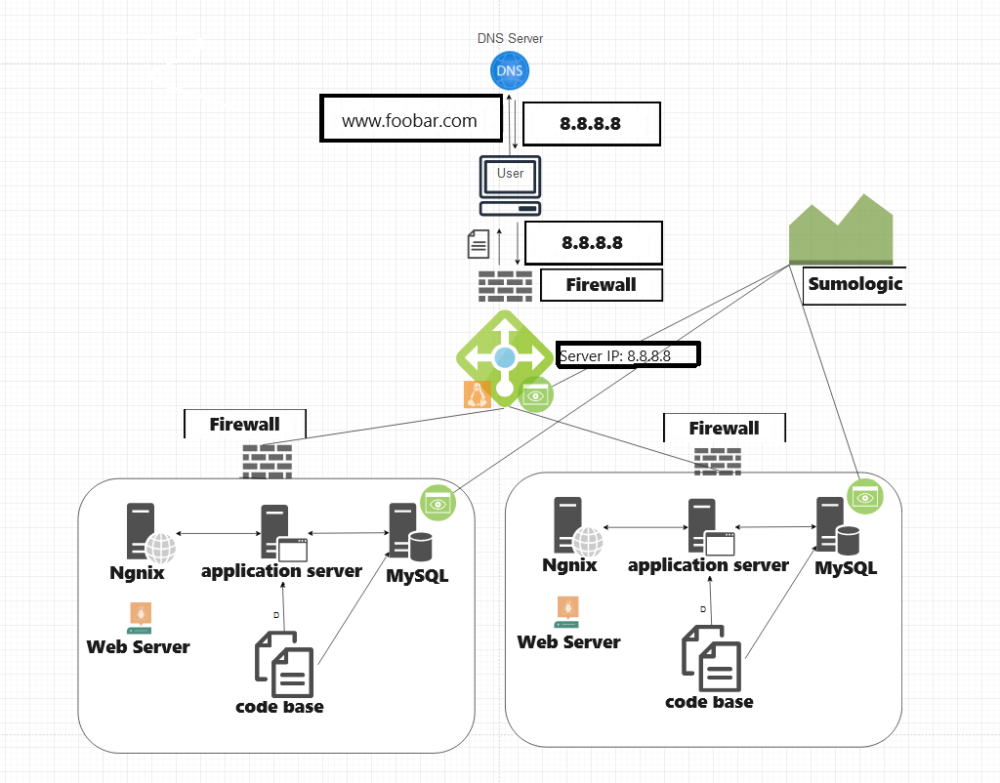

# Secured and Monitored Web Infrastructure

## Description

This is a 3-server web infrastructure designed to be secure, monitored, and to serve encrypted traffic.

## Specifics About This Infrastructure

+ **Firewall Purpose:** Firewalls protect the network (specifically the web servers) from unwanted and unauthorized users. They act as intermediaries between the internal and external networks, blocking incoming traffic that matches unauthorized criteria.

+ **SSL Certificate Purpose:** SSL certificates encrypt traffic between the web servers and the external network, preventing man-in-the-middle attacks (MITM) and network sniffers from intercepting traffic. SSL certs ensure privacy, integrity, and identification.

+ **Monitoring Clients Purpose:** Monitoring clients monitor servers and the external network, analyzing performance and operations, measuring overall health, and alerting administrators if servers are not performing as expected. Monitoring tools observe servers, provide key metrics about server operations, automatically test server accessibility, measure response time, and alert for errors such as corrupt/missing files, security vulnerabilities/violations, and other issues.

## Issues With This Infrastructure

+ Terminating SSL at the load balancer level would leave traffic between the load balancer and the web servers unencrypted.

+ Having only one MySQL server is an issue because it is not scalable and can act as a single point of failure for the web infrastructure.

+ Servers with all the same components contend for resources (CPU, Memory, I/O, etc.), leading to poor performance and difficulty in locating problems. This setup is not easily scalable.

